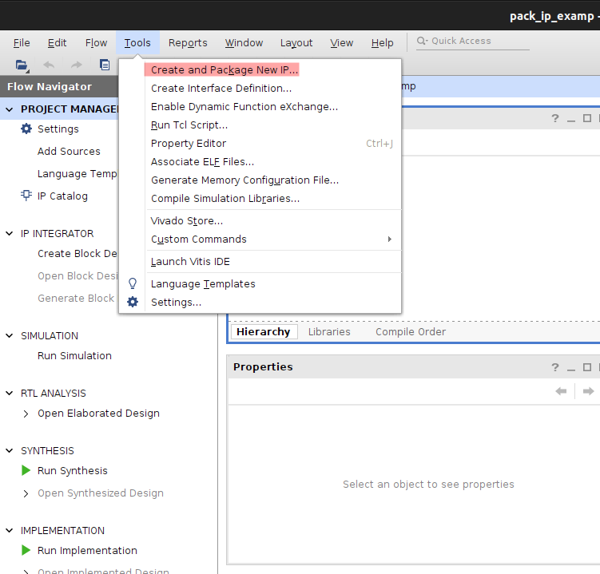
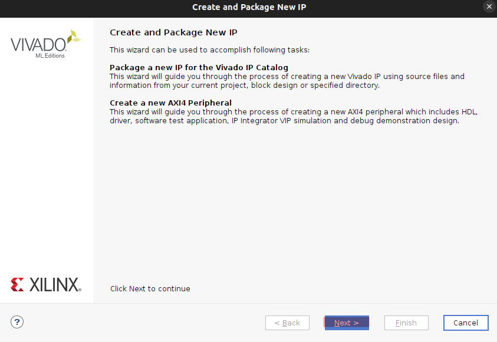
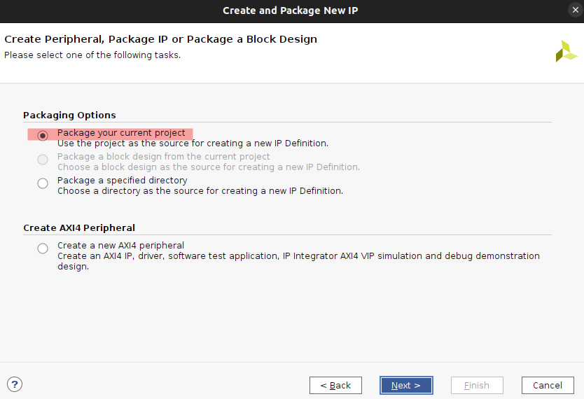
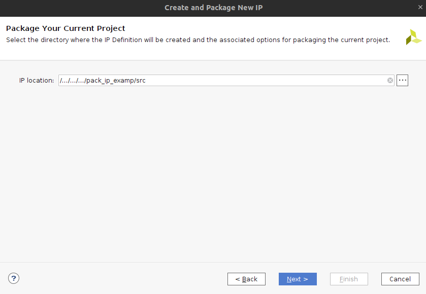
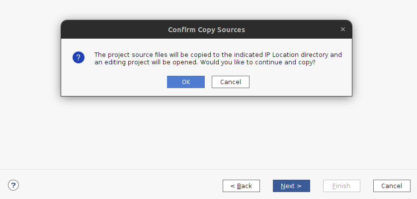
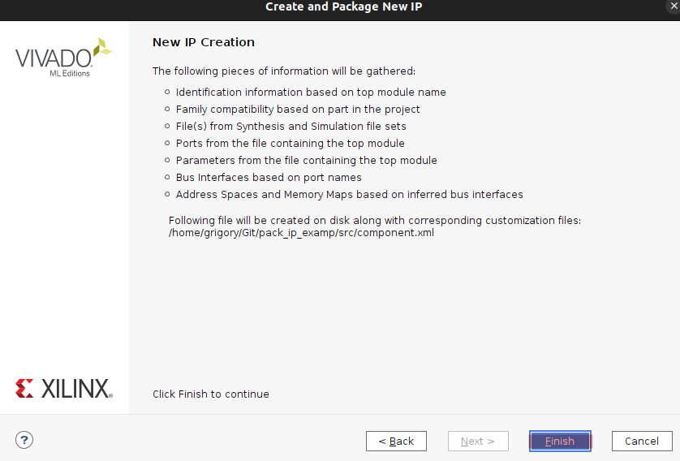
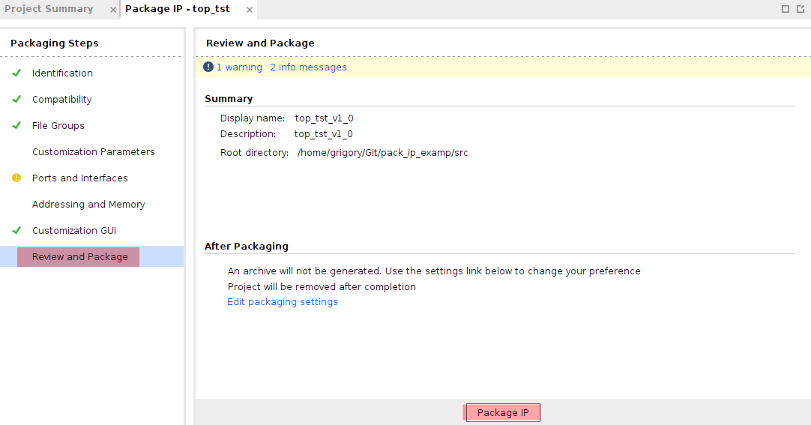
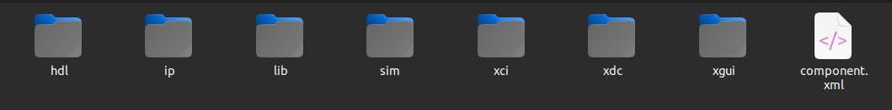

# Инструкция по упаковке IP

14.03.2025

## При создании IP из проекта необходимо руководствоваться интсрукцией

### Создание проекта

Создавать проект и следовать её иерархии следует с помощью скрипта create_project.sh.

В ходе исполнения скрипта появляется следующая структура:

``` none
├── build.sh - project shell build script for re-creating project and building it.
├── build.tcl - project tcl build script for re-creating, synthesizing and implementing the project.
├── cfg - directory for project configuration files. 
│   ├──synthesis.tcl - pre-synthesis run script. Used to set variables with build date, time and git hash.
│   └──bitstream.tcl - post-bitstream run script.
├── create_project.sh - file for creating the project.
├── dbg - project directory for debugging files like.
├── doc - project documentation directory for file types like with markdown or asciidoc, etc.
├── out - project output directory. Version control is disabled for this directory.
├── prj - vivado project directory. Version control is disabled for this directory.
└── src - project sources directory.  
    ├── hdl - hardware description language source files: vhdl, verilog and system verilog.   
    ├── lib - imported sources.
    ├── sim - simulation files.
    ├── xci - directory for Xilinx IP core files.
    └── xdc - directory for Xilinx constraint files.
```

Созданный проект хранится в директории prj.

### Упаковка IP

Для того, чтобы упаковать IP следует:

- В меню Vivado в контекстном меню выбрать Tools -> Create and Package New IP... (рисунок 1)


Рисунок 1


- В появившемся меню выбрать Next > (рисунок 2)

Рисунок 2


- Далее выбрать Package your current project (рисунок 3) и нажать Next >

Рисунок 3


- В следующем появившемся окне в качестве директории расположения IP выбрать / ... /**_prj_name_**/src и нажать Next > (рисунок 4)

Рисунок 4


- Подтвердить копирование файлов (рисунок 5)

Рисунок 5


- Закончить упаковку IP нажатием Finish (рисунок 6)

Рисунок 6


В итоге открывается окно временного редактирования IP, где можно настроить параметры, порты, изменить GUI и др.

После того, как все изменения внесены, и IP готово к использованию необходимо нажать Package IP (рисунок 7)

Рисунок 7


В итоге, в каталоге src образуется файл component.xml (рисунок 8).

Рисунок 8


Также, создаётся каталог xgui, в котором хранится .tcl файл IP.

Помимо этого, может быть создан каталог gui с файлос .gtcl.

### На этом IP упаковано и готово к использованию в проектах
